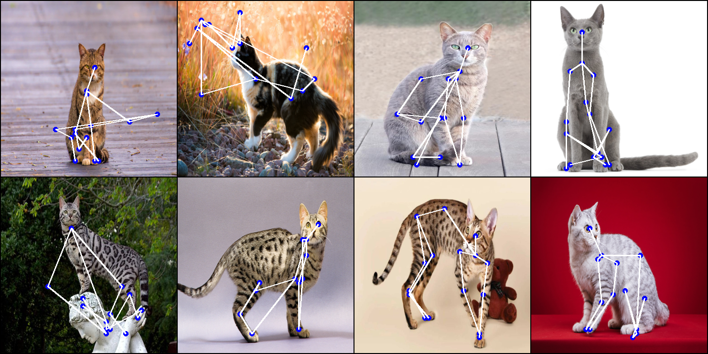
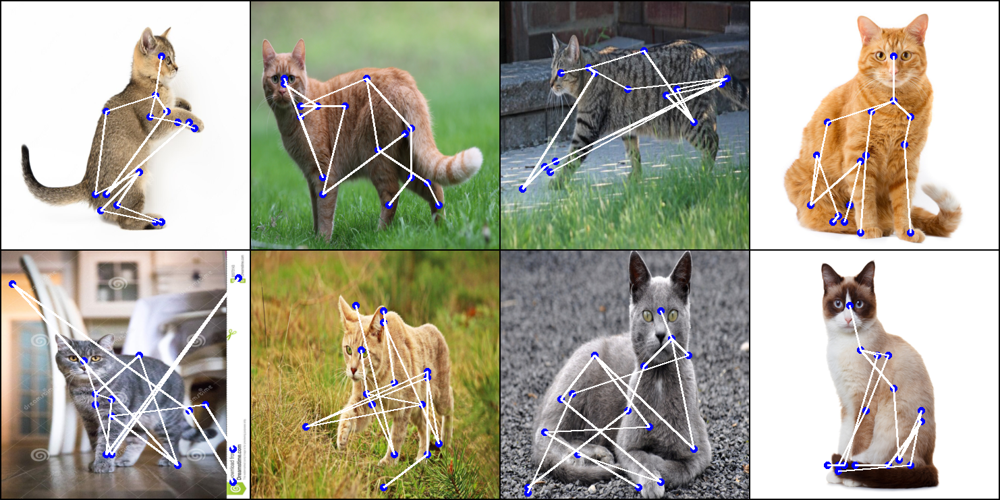
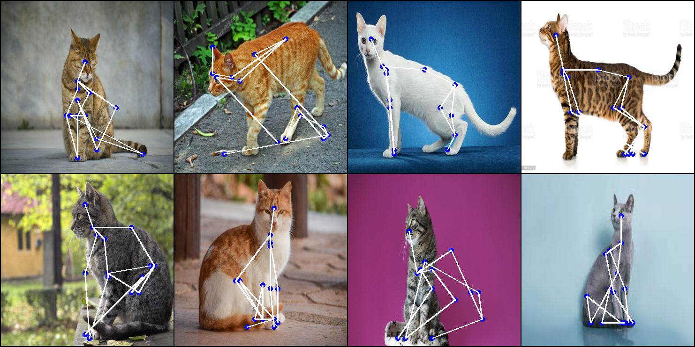

# Animal Pose Estimation

This repository presents a pipeline for training and testing Convolutional Pose Machines model on self-made animal
keypoints dataset for pose prediction.

## Approach


Model used in current pipeline is based on Convolutional Pose Machines model described in
[this paper](https://arxiv.org/pdf/1602.00134.pdf). Normalization was added to the model (class of normalization layer
is specified in `model.norm_layer` field of config file), as well as dropout (dropout value is specified in the
`model.drop_rate` field of the config file). The model was trained on self-labeled tiny dataset of cat images. Due to
small size of the dataset, augmentations such as: random flip, random crop, random rotation were used to increase
variety of training examples during training. It is planned to replace self-written augmentations
(`utils/transforms.py`) with more universal Albumentations ones.

## Available models

At the moment, there is only one model available. It is planned to add Visual Transformer for pose estimation in the
future.

|            Name             | Params | Estimated model params size (MB) |
|:---------------------------:|:------:|:--------------------------------:|
| Convolutional Pose Machines | 40.2 M |              160.82              |

## Available datasets

At the moment, there is only one dataset available. It is planned to use existing ready-made animal pose datasets in the
future.

|           Name           | Train data size | Validation data size | Test data size | Sample fields                                                                                                                                                                                                                                                            |
|:------------------------:|:---------------:|:--------------------:|:--------------:|:-------------------------------------------------------------------------------------------------------------------------------------------------------------------------------------------------------------------------------------------------------------------------|
| Animal Keypoints Dataset |       138       |          ✗           |       24       | - sample["image"] - image<br/>- sample["keypoints"] - coordinates and visibility (if [requested](#keypoints)) of keypoints<br/>- sample["heatmap"] - (if heatmap_size [provided](#heatmaps)) heatmaps with probabilities of each keypoint to be located in current pixel |

## Animal Keypoints Dataset

### Keypoints

`keypoints` field of the dataset entry contains a tensor of shape (16, 3), which contains relative (0.1, 0.92, etc.)
coordinates of skeleton points. Keypoints are stored in the following order:

- head
- upper spine
- left shoulder
- left elbow
- front left paw
- right shoulder
- right elbow
- front right paw
- center spine
- bottom spine
- left knee
- left heel
- rear left paw
- right knee
- right heel
- rear right paw

The rule according to which images were labeled is shown in the figure below:


The coordinates have format (y, x, visibility), where visibility is 1 if point is visible and 0 if point is blocked by
other objects on photo. Visibility is provided if `dataset.produce_visibility=True` in config file (or if this parameter
is passed to dataset class constructor: `AKD(..., produce_visibility=True, ...)`). Otherwise, a tensor of shape (16, 2)
with only y and x coordinates will be returned

Example of labeled samples is shown in the figure below:


### Heatmaps

**Heatmap** is a belief map for every keypoint. Value of each pixel of nth map (nth channel of heatmap) is equal to
probability of nth keypoint being located in that pixel.

`heatmap` field of the dataset entry contains a tensor of shape (16, heatmap_size, heatmap_size), where heatmap_size value
is taken from dataset.heatmap_size field of config file (or from value of parameter `heatmap_size` passed to dataset
class constructor: `AKD(..., heatmap_size=45, ...)`). Order of 16 channels of the tensor matches the order of keypoints
given above. `heatmap` field is added to dictionary **only if heatmap_size is specified and is not `0`**. Heatmaps are
generated automatically based on true keypoints' coordinates. Gaussians are used to mark keypoints' locations. If
`produce_visibility=True`, then Gaussian is negative for non-visible keypoints, and positive for visible. Otherwise
all Gaussians will be positive.

**DISCLAIMER:** heatmap shape (heatmap_size, heatmap_size) is not equal to image shape in general!
Since heatmap is an output of Convolutional Pose Machines, and the model uses pooling, heatmap size will be several
times smaller than original image size. It is highly recommended to pass tensor of shape
`(1, 3, image_size, image_size)` to network before it's training and check output tensor's shape to see, what heatmap
size you should specify in config file.

Below are several sample images with overlaid heatmaps (green areas correspond to visible points,
purple - to non-visible points):


## Results 

### Loss


### Metric


### Predictions

Along with anatomically correct predictions, Convolutional Pose Machine still confuses symmetric parts and generates
noisy results.





## Config

Most of the changes of pipeline's structure and parameters are made by modifying configuration file `config.yaml` in
`/conf` directory. In case of adding new models, datasets, etc. it is recommended to instantiate them by specifying in
the config (not directly in code, i.e. `module = MyModule(*params); dataset = MyDataset(*other_params)`), since the
project utilizes `instantiate` method from `hydra` package, thus avoiding direct call of object's constructor and making
the code more independent.

Configuration file contains following fields:

```yaml
lit_module: Pytorch Lightning Module
model: model that will be wrapped in LitModule and trained
loss: loss used during training
metric: metric used during training
optimizer: optimizer that will tune weights during training
scheduler: scheduler that will change learning rate value during training
dataset: dataset on which model will be fitted
trainer: trainer parameters like "max_epochs", "accelerator", etc.
logger: logger (e.g. WandbLogger) used to log loss, metric and other values passed to self.log() in LitModule
train_augmentations:
  all:
    - augmentations that will
    - affect both image and ketpoints
    - during training
  image:
    - augmentations that will
    - affect only image
    - during training
  target:
    - augmentations that will
    - affect only keypoints
    - during training
test_augmentations:
  all:
    - same as
    - above
  image:
    - but takes place
    - during
  target:
    - test
callbacks:
  - list of
  - Pytorch Lightning callbacks
  - (e.g. LearningRateMonitor, ModelCheckpoint)
seed: seed that will be set for all random generators
checkpoint_path: if specified, LitModule will be loaded from corresponding checkpoint 
```

Available values for group fields listed above can be seen in models.config_dataclasses.py

## Installation

Clone this repository:

```
git clone https://github.com/TechNumber/pytorch_course_animal_pose_estimation.git
cd ./pytorch_course_animal_pose_estimation/
```

Install PyTorch and other dependencies:

```
conda create -n {env_name} python=3.10
conda activate {env_name}
conda install pytorch torchvision pytorch-cuda=11.7 -c pytorch -c nvidia
# OR if your PC does not have a GPU:
conda install pytorch torchvision cpuonly -c pytorch
conda install torchmetrics pytorch-lightning hydra-core wandb matplotlib matplotlib-inline numpy omegaconf -c conda-forge
pip install Pillow
```

## Training and inference

1. Log into your WandB acount:

```bash
wandb login
```

2. Download Convolutional Pose
   Machines [checkpoint](https://drive.google.com/file/d/1ISfAmiquXDV5fx8yLeWuKdtLcVqO5XX0/view?usp=sharing).
2. Put downloaded .ckpt file into pose_estimation/cats/checkpoints folder.
3. Uncomment `checkpoint_path:` field in conf/config.yaml and replace `'./checkpoints/last.ckpt'`
   with `'./checkpoints/{name of downloaded file}.ckpt'`.
4. Run this command for testing:

```bash
python3 pose_estimation/cats/test.py
```

5. Run this command for training:

```bash
python3 pose_estimation/cats/train.py
```

Results will appear in your WandB "animal_pose_estimation" project.