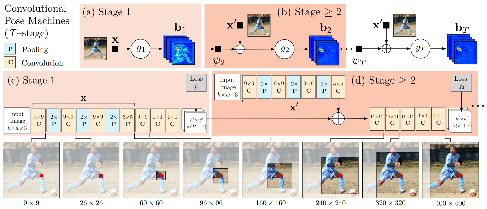
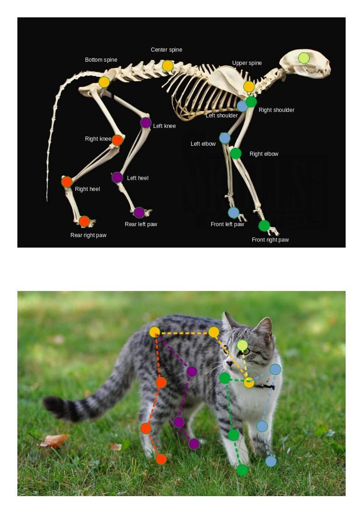
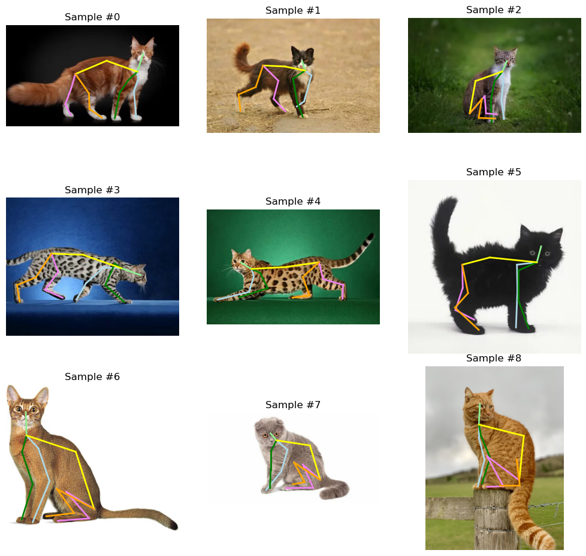
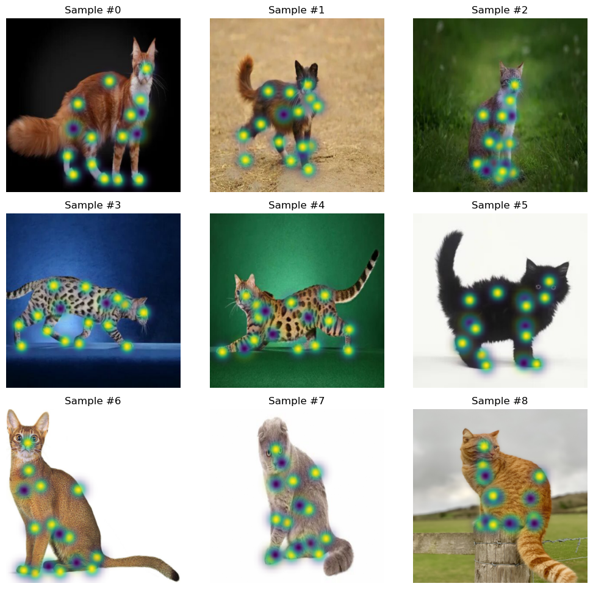

# Animal Pose Estimation

Insert description

## Approach



За основу была взята модель Convolutional Pose Machines, описанная
в [данной статье](https://arxiv.org/pdf/1602.00134.pdf). В модель была добавлена нормализация (класс нормализации
указывается в поле "model.norm_layer" конфигурационного файла),
а также dropout (величина dropout указывается в поле "model.drop_rate" конфигурационного файла). Модель была обучена на
вручную собранном и размеченном маленьком датасете изображений котов. В силу маленького размера датасета, для повышения
разнообразия обучающих примеров при обучении к датасету применялись аугментации, такие как: random flip, random crop,
random rotation. Впоследствии планируется заменить вручную написанные аугментации на более универсальные
Albumentations-аугментации.

## Available models

|            Name             | Params |     |
|:---------------------------:|--------|-----|
| Convolutional Pose Machines | 40.2 M |     |

## Available datasets

At the moment, there is one self-made dataset available. It is planned to use existing ready-made animal pose datasets
in the future.

|           Name           | Train data size | Validation data size | Test data size | Sample fields                                                                                                                                                                                                                                                    |
|:------------------------:|:---------------:|:--------------------:|:--------------:|:-----------------------------------------------------------------------------------------------------------------------------------------------------------------------------------------------------------------------------------------------------------------|
| Animal Keypoints Dataset |       138       |          ✗           |       24       | - sample["image"] - image<br/>- sample["keypoints"] - coordinates and visibility (if [requested](#keypoints)) of keypoints<br/>- sample["heatmap"] - (if heatmap_size [provided](#heatmaps)) heatmaps with probabilities of each keypoint to be in current pixel |

## Animal Keypoints Dataset

[//]: # (Запись в датасете представляет собой словарь с полями "image" и "keypoints", содержащие изображение и координаты опорных)

[//]: # (точек соответственно.)

### Keypoints

Поле "keypoints" записи из датасета хранит в себе тензор размера (16, 3) с координатами опорных точек скелета. Опорные
точки записаны в следующем порядке:

- head
- upper spine
- left shoulder
- left elbow
- front left paw
- right shoulder
- right elbow
- front right paw
- center spine
- bottom spine
- left knee
- left heel
- rear left paw
- right knee
- right heel
- rear right paw

Правило, в соответствии с которым происходило размечивание, представлено на рисунке ниже:



Координаты имеют формат (y, x, visibility), where visibility is 1 if point is visible and 0 if point is blocked by other
objects on photo. Visibility is provided если dataset.produce_visibility=True в конфигурационном файле (или параметр
передан в
конструктор класса датасета: `AKD(..., produce_visibility=True, ...)`). В противном случае будет возвращён тензор
размера (16, 2) только с координатами y и x.

Пример разметки записей в датасете представлен ниже:



### Heatmaps

**Heatmap** - это карта вероятностей каждой опорной точки. Значение каждого пикселя n-го слоя heatmap равно вероятности
того, что в данном пикселе содержится n-ая опорная точка.

Поле "heatmap" записи из датасета хранит в себе тензор размера (16, heatmap_size, heatmap_size), где параметр
heatmap_size берётся из поля dataset.heatmap_size конфигурационного файла (или из значения параметра, передаваемого в
конструктор класса датасета: `AKD(..., heatmap_size=45, ...)`). Порядок
следования 16-ти каналов тензора соответствует порядку опорных точек, представленному выше.
Поле "heatmap" добавляется к словарю записи sample только если heatmap_size is specified and not `0`.  
Heatmaps составляются автоматически на основе true координат опорных точек при помощи гауссиан. Причём если
`produce_visibility=True`, то для non-visible keypoints гауссиана отрицательна, а для visible положительна.

**DISCLAIMER:** в случае с Convolutional Pose Machines размер heatmap (heatmap_size, heatmap_size) не равен размеру
изображения! Поскольку heatmap является выходом Convolutional Pose Machines, а в модели используется пулинг, размер
heatmap будет в несколько раз меньше размера исходного изображения. It is highly recommended to pass tensor of shape
`(1, 3, image_size, image_size)` and check the output tensor's shape to see, what heatmap size you should specify in
config file.

Ниже представлены несколько изображений из датасета с наложенными heatmaps (зелёные области показывают видимые точки,
фиолетовые - невидимые):



## Config

Все основные манипуляции с параметрами и структурой пайплайна выполняются через конфигурационный файл config.yaml в
директории conf. При добавлении новых моделей, датасетов и т.д. рекомендуется создавать их через конфиг, а не напрямую
в коде, поскольку проект заточен под метод instantiating модуля hydra, избегая прямого вызова конструктора объекта. 

Конфигурационный файл содержит следующие поля:

```yaml
lit_module: Pytorch Lightning Module
model: model that will be wrapped in LitModule and trained
loss: loss used during training
metric: metric used during training
optimizer: optimizer that will tune weights during training
scheduler: scheduler for non-constant learning rate
dataset: dataset on which model will be fitted
trainer: trainer parameters like "max_epochs", "accelerator", etc.
logger: logger (e.g. WandbLogger) used to log loss, metric and other values passed to self.log() in LitModule 
train_augmentations:
  all:
    - augmentations that will
    - affect both image and ketpoints
    - during training
  image:
    - augmentations that will
    - affect only image
    - during training
  target:  
    - augmentations that will
    - affect only keypoints
    - during training
test_augmentations:  
  all:
    - same as
    - above
  image:
    - but takes place
    - during
  target:
    - test
callbacks:
  - list of 
  - Pytorch Lightning callbacks
  - (e.g. LearningRateMonitor, ModelCheckpoint)
seed: seed that will be set for all random generators
checkpoint_path: if specified, LitModule will be loaded from checkpoint
```

Available values for group fields, listed above, can be seen in models.config_dataclasses.py

## Installation


